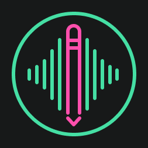

# **Congent**

🤖 **Congent**: Congent is an open-source platform that allows for the creation of social media content from unstructured text, like transcripts of conversations.

### [Homepage COMING SOON](https://congenti.no)

## What is Congent
TODO

## Contributing
This project welcomes contributions and suggestions.

If you're passionate about what we're doing and would like to get paid while developing, feel free to reach out. We're constantly looking for innovators and passionate developers.
